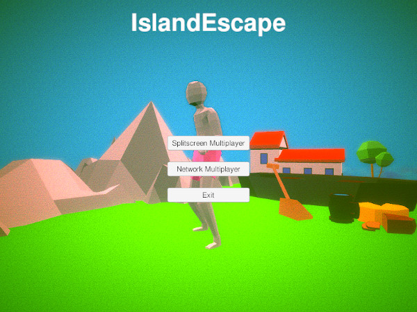
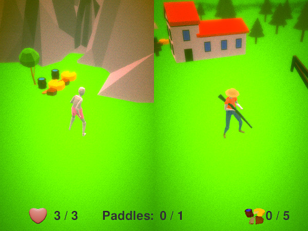

###### 3m5 GameJam May 2019
# IslandEscape

Island escape was created during the 3m5 GameJam in May 2019. We were given a
random selection of words and created this game out of a subset of those words.

## Disclaimer

This game contains content related to the topic of slavery. The topic was chosen
randomly during a game jam. We do not wish to play down the seriousness of the
topic of slavery nor the consequences it has had and still has on society and
those affected by it.

## Instructions

Choose to play in split screen 2-player or network 2-player. One player is a
slave and the other a landlord of an island. It is the slave's mission to get
food necessary for the escape and a paddle for the boat and to leave the island
on the boat. The landlord tries to stop the slave by shooting.

IslandEscape supports keyboard and DualShock2-like joystick gamepads.

## Screenshots

